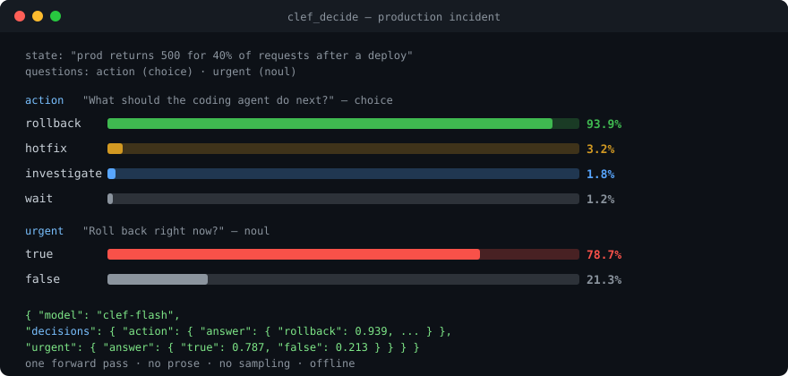
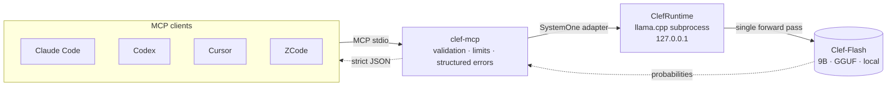

<div align="center">



# clef-mcp

[](https://www.npmjs.com/package/clef-mcp)
[](https://www.npmjs.com/package/clef-mcp)
[](https://github.com/HighlyLoadedEgo/ClefMCP/actions/workflows/ci.yml)
[](https://registry.modelcontextprotocol.io)
[](LICENSE)

**A "reflex" for AI coding agents: structured decisions with probabilities — not prose.**

Local [MCP](https://modelcontextprotocol.io) server that gives agents (Claude Code, Codex, Cursor, ZCode, …) access to the **Clef-Flash** decision model (9B, Apache-2.0 by Cloudflare) through a single tool: `clef_decide`. Pass a `state` and typed questions, get a **probability distribution over your options** in one forward pass. Fully local, offline, no tokens burned.

</div>

---

## Quick start

```bash
# 1. Detect hardware, download the model (~6 GB) + llama.cpp runtime, verify checksum + inference
npx clef-mcp install

# 2. Register the MCP server + agent skill in your clients (zcode, claude-code, codex, cursor)
npx clef-mcp setup

# 3. Run the MCP server (stdio)
npx clef-mcp
```

`clef-mcp` (step 3) never downloads anything. If the model is missing, tool calls return a structured `MODEL_NOT_INSTALLED` error with a hint. Steps 1 and 2 combine: `npx clef-mcp install --setup`.

## Why not just ask the LLM?

| | Chat LLM | `clef_decide` |
|---|---|---|
| Output | prose, you parse it | strict JSON: probability per option |
| Determinism | varies per run | single forward pass, no sampling |
| Latency (1 decision) | seconds of generation | ~0.5 s local |
| Context cost | grows with every decision | fixed, small schema |
| Privacy | depends on provider | 100% on-device, works offline |
| Calibration | vibes | softmax over trained option scores |

Sweet spot: **decision points inside agent loops** — next action, routing, classification, severity, yes/no judgment — asked dozens of times per task.

## The `clef_decide` tool

```json
{
  "state": {
    "task": "Fix failing tests",
    "error": "TypeError: Cannot read properties of undefined"
  },
  "questions": {
    "next_action": {
      "type": "choice",
      "instructions": "What should the coding agent do next?",
      "criteria": {
        "inspect": "Inspect the code and gather more information",
        "modify": "Modify the code",
        "test": "Run additional tests",
        "ask_user": "Ask the user for clarification"
      }
    },
    "confidence": {
      "type": "score",
      "instructions": "How confident are you in this decision?",
      "criteria": ["very_low", "low", "medium", "high", "very_high"]
    },
    "is_outage": { "type": "noul", "instructions": "Is a service down?" }
  }
}
```

| Type | Criteria | Answer |
|------|----------|--------|
| `choice` | map `option id → description`, or a plain list | probability per option |
| `score` | ordered list (index = score) | probability per level |
| `noul` | optional `{"true": "...", "false": "..."}` | `{"true": p, "false": 1-p}` |

Response — strictly structured, never prose:

```json
{
  "model": "clef-flash",
  "decisions": {
    "next_action": { "answer": { "inspect": 0.72, "modify": 0.12, "test": 0.14, "ask_user": 0.02 } },
    "confidence":  { "answer": { "very_low": 0.01, "low": 0.04, "medium": 0.18, "high": 0.61, "very_high": 0.16 } },
    "is_outage":   { "answer": { "true": 0.9, "false": 0.1 } }
  }
}
```

Batch up to **64 questions per call** — they are scored in one forward pass. `state` is treated strictly as **data**: never executed, never interpreted as instructions for the server.

## Measured, not marketed

Apple M4 Pro, Clef-Flash Q4_K_M (6 GB), single request through the full MCP stdio path:

| Scenario | Latency |
|---|---|
| Cold start (incl. model load, once per session) | ~4.4 s |
| 1 question | ~0.5 s |
| 10 questions, one call | ~2.9 s |
| 64 questions, one call | ~18.6 s |

Quality gate: a 30-case evaluation dataset (coding / security / classification / routing / yes-no) — **86.7% pass** on the live model. Run it yourself: `clef-mcp evals`.

## Register with your MCP client

<details open>
<summary><b>Claude Code</b></summary>

```bash
claude mcp add clef-mcp -- clef-mcp
# or, without a global install:
claude mcp add clef-mcp -- npx -y clef-mcp
```
</details>

<details>
<summary><b>Codex</b> — <code>~/.codex/config.toml</code></summary>

```toml
[mcp_servers.clef-mcp]
command = "clef-mcp"
args = []
```
</details>

<details>
<summary><b>Cursor</b> — <code>.cursor/mcp.json</code></summary>

```json
{
  "mcpServers": {
    "clef-mcp": { "command": "clef-mcp", "args": [] }
  }
}
```
</details>

<details>
<summary><b>ZCode</b> — <code>~/.zcode/cli/config.json</code> (user scope, auto-connect)</summary>

```json
{
  "mcp": {
    "servers": {
      "clef-mcp": { "command": "clef-mcp", "args": [], "type": "stdio" }
    }
  }
}
```
</details>

Ready-made snippets: [`examples/`](examples/).

## Teach your agent (skill)

The schema tells the client *what* `clef_decide` accepts; agents also need to know *when* to reach for it and *how* to frame decisions. The bundled [`clef-decisions`](skills/clef-decisions/SKILL.md) skill covers decision patterns, batching, criteria writing, distribution interpretation and error recovery:

```bash
clef-mcp setup                                                    # automatic
cp -r skills/clef-decisions ~/.agents/skills/                     # manual, from repo
cp -r "$(npm root -g)/clef-mcp/skills/clef-decisions" ~/.agents/skills/  # from npm package
```

## Architecture



The `ClefRuntime` interface (`load / decide / unload / health`) isolates the engine: MLX or remote runtimes plug in without changing the MCP API. The wire format is `POST /v1/systemone` — the same contract across llama.cpp and other Clef runtimes.

## CLI

```bash
clef-mcp              # run the MCP server on stdio (default command)
clef-mcp install      # detect hardware → download model + runtime → verify checksum → verify inference
clef-mcp setup        # register the MCP server + agent skill in zcode / claude-code / codex / cursor
clef-mcp models       # list models/quantizations and install status
clef-mcp status       # runtime, model, memory summary
clef-mcp doctor       # full diagnosis (platform, RAM, GPU, binary, model, checksum*, inference, MCP config)
clef-mcp uninstall    # remove the model (and optionally the managed runtime)
clef-mcp evals        # run the evaluation dataset against the installed model
```

Flags: `install --quant Q8_0 --yes --skip-probe`, `install --setup`, `setup --clients zcode,cursor --no-skill`, `doctor --deep` (re-hash the model file), `uninstall --runtime --yes`.

## Configuration

| Variable | Default | Meaning |
|----------|---------|---------|
| `CLEF_MODEL` | `clef-flash` | Model id (per-call `model` also accepted) |
| `CLEF_HOME` | `~/.cache/clef-mcp` | Cache/model home |
| `CLEF_RUNTIME` | `llama-cpp` | Inference runtime (v0.1: only llama-cpp) |
| `CLEF_LOG_LEVEL` | `error` | `error` \| `warn` \| `info` \| `debug` (stderr only) |
| `CLEF_LLAMA_BIN` | – | Explicit `llama-server` binary path |
| `CLEF_LLAMA_RELEASE_TAG` | latest nightly | Pin the managed llama.cpp build |
| `CLEF_LLAMA_BATCH` | `8192` | llama.cpp physical batch (multi-question requests) |
| `CLEF_MAX_QUESTIONS` | `64` | Max questions per call |
| `CLEF_MAX_STATE_BYTES` | `1048576` | Max serialized `state` size |
| `CLEF_MAX_INSTRUCTION_CHARS` | `10000` | Max chars per question instructions |

Runtime resolution: `CLEF_LLAMA_BIN` → managed binary in `CLEF_HOME/runtime` → `llama-server` on `PATH`.

Storage: `CLEF_HOME/models/<model>/<quant>/` (model + `manifest.json` with repo/revision/sha256/license) and `CLEF_HOME/runtime/llama.cpp/`.

The model is downloaded from the pinned official GGUF conversion ([ggml-org/Clef-Flash-GGUF](https://huggingface.co/ggml-org/Clef-Flash-GGUF)) and **sha256-verified** against Hugging Face's content hash. It is never repackaged by clef-mcp. Also listed in the [official MCP Registry](https://registry.modelcontextprotocol.io) as `io.github.HighlyLoadedEgo/clef-mcp`.

## Error handling

```json
{
  "error": {
    "code": "MODEL_NOT_INSTALLED",
    "message": "Clef model \"clef-flash\" is not installed.",
    "hint": "Run `clef-mcp install`."
  }
}
```

Codes: `MODEL_NOT_INSTALLED`, `MODEL_LOAD_FAILED`, `RUNTIME_NOT_FOUND`, `RUNTIME_INIT_FAILED`, `RUNTIME_NOT_SUPPORTED`, `INVALID_INPUT`, `CLEF_INFERENCE_FAILED`, `UNSUPPORTED_PLATFORM`, `OUT_OF_MEMORY`, `CHECKSUM_MISMATCH`, `DOWNLOAD_FAILED`. Input exceeding the 16k-token model context is rejected with a hint to reduce the state.

## Security & data handling

- No network servers, no telemetry, no accounts; everything runs locally.
- The model downloads only on an explicit `install`, over HTTPS, checksum-verified.
- `state` content is passed to the model as data; the server never executes or instruction-interprets it.
- Filesystem access is limited to `CLEF_HOME` (plus reading standard MCP client config paths in `doctor`).
- The managed runtime is the official llama.cpp build; pin it with `CLEF_LLAMA_RELEASE_TAG`.

See [SECURITY.md](SECURITY.md) for the full policy.

## Development

```bash
npm install
npm run build
npm test          # unit + integration (fake llama-server, no model needed)
npm run evals     # needs an installed model; exit code reflects pass rate
```

See [CONTRIBUTING.md](CONTRIBUTING.md) and [`tests/evals/dataset.jsonl`](tests/evals/dataset.jsonl).

## License

- Code: [Apache-2.0](LICENSE).
- Clef / Clef-Flash model: © Cloudflare, [Apache-2.0](https://huggingface.co/Cloudflare/clef-flash) — see [NOTICE](NOTICE).
- llama.cpp runtime: © its authors, MIT-licensed; downloaded as an official prebuilt binary.
